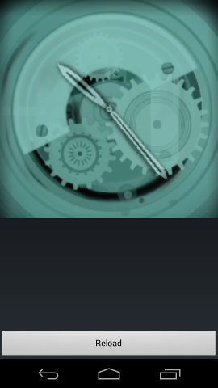
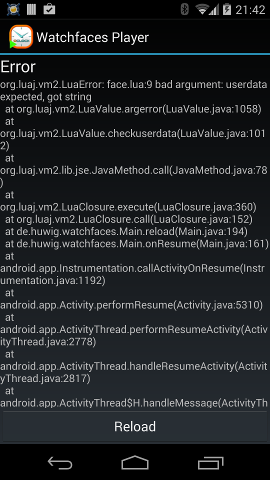
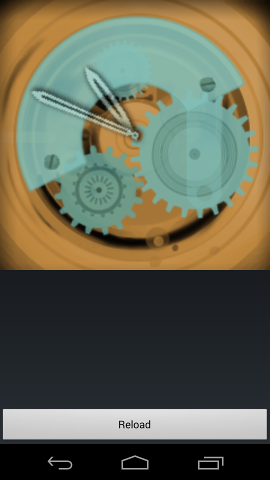
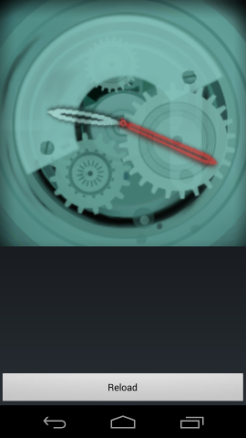
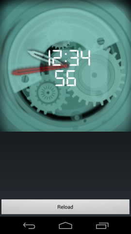

Watchfaces Developer Tutorial
=============================

This app allows you to develop your own watch faces.

Usage
=====

Install the [Watchfaces app](https://play.google.com/store/apps/details?id=de.huwig.watchfaces) on your Android device and launch the app.
This is an evaluation version that you could use, but it will switch the face every 15 seconds.
Double-tap on the screen to get to the settings and select **Buy app** to do an in-app purchase.
After you have bought the app, de-select **Switch face every 15 seconds** and select **Developer mode**.

After installation, all graphics and the watch logic come from the APK itself.
Let's change this and alter the face.
It's best if you connect your Android device with a USB cable to your computer and mount the SD card.
Clone the [Git repository](https://github.com/kurthuwig/faces.git) or - if you don't know what "cloning a Git repository" means - download the [ZIP archive of the project](https://github.com/kurthuwig/faces/archive/master.zip) and unpack it.
Copy the `Watchfaces` folder to the top-level directory of your SD card folder on your Android device,
keeping the folder structure instact.
Don't worry, even if you don't have a physical SD card in your device, every Android device has at least an emulated SD card.
Your SD card should then contain a folder `Watchfaces` with many subfolders including the subfolder `example` containing the tutorial watchface.

The X-Ray watchface will be available twice:

Select the one that shows **Example** as the author and name of the face.

On the SD-card within the folder `Watchfaces` the subfolder `example` contains several files:

  * `all.atlas` and `all.png`: these were generated by the [GDX Texturepackage](https://code.google.com/p/libgdx-texturepacker-gui/) and store multiple graphics very efficently
  * `face.lua` contains the watch logic and is the file we focus on
  * several `.png` files: these contain the graphics that are also in `all.png`.
    We will work with them.

Open the `face.lua` in the text editor of your choice, e.g. `gedit` on Ubuntu or `wordpad` on Windows.
The file looks like this:

    function about()
        local result = {}
        result.author = "Mak Mark"
        result.name   = "X-Ray"
        return result
    end
    
    function init()
        local atlas = face:loadAtlas('all.atlas')
        face:add(atlas:createSprite('bottom_layer'))
    
        bigGear = atlas:createIndexedSprite('big_gear')
        bigGear:setPosition(115, 79)
        face:add(bigGear)
    
        middleGear = atlas:createIndexedSprite('middle_gear')
        middleGear:setPosition(47, 128)
        face:add(middleGear)
    
        littleGear = atlas:createIndexedSprite('little_gear')
        littleGear:setPosition(81, 35)
        face:add(littleGear)
    
        face:add(atlas:createSprite('top_layer'))
    
        hourHand = atlas:createSprite('hour_hand')
        hourHand:setPivot(11.4, 106);
        hourHand:setPosition(120, 120)
        face:add(hourHand)
    
        minuteHand = atlas:createSprite('minute_hand')
        minuteHand:setPivot(11.4, 106)
        minuteHand:setPosition(120, 120)
        face:add(minuteHand)
    end
    
    function update()
        local hour   = time:get(Calendar.HOUR)
        localminute = time:get(Calendar.MINUTE)
        local second = time:get(Calendar.SECOND)
    
        bigGear   :setIndex(second % 3)
        middleGear:setIndex(second % 3)
        littleGear:setIndex((second / 2) % 3)
    
        hourHand  :setRotation(360 / 12 * (hour + minute / 60))
        minuteHand:setRotation(360 / 60 * (minute + second / 60))
    end

It is written in [Lua](http://www.lua.org) a very easy programming language.
If you have done some programming before, it should be very easy to understand even without reading the documentation - which you should do anyway!
It contains 3 functions:

   * `about()`: this defines the author and the name of the face
   * `init()`: this initialized the watchface - usually reading the graphics and adding them to the watch face
   * `update()`: this updates the graphics according to the current time

Global variables
----------------

There are 3 global variables:

   * `face`: needed to initialize the clockface
   * `time`: the current time (see [Java Calendar constants](http://developer.android.com/reference/java/util/Calendar.html#constants) for details on how go get different aspects of the time)
   * `deviceStatus`: the current status of the device

Error messages
--------------

The bad news first: You will get error messages like this:

They happen if there is a problem with you Lua file and the app cannot figure out what you want.
Have a look at the first line.
Usually it contains something like `face.lua:9`.
This means that the problem is in line 9 of the Lua file - have a look at this line and try to find out why it is wrong.
After that comes an error message that hints what might went wrong:

### bad argument: userdata expected, got X

Have a look if you wrote a `.` instead of a `:` between a variable and the method to call.

### vm error: java.io.FileNotFOundException: X

The given file cannot be found.
Double check the path and filename.

### unexpected symbol x (y)

There is a character that does not belong here.

### 'end' expected (to close 'X' at line Y)

Check your opening (`function`, `if` etc) constructs and the corresponding closing `end` statements.

### vm error: java.lang.NullPointerException: X is null

Check the variables that you use:
you might have a typo or forgotten to initialize it.

### function '*name*' does not exist

The check that the function with the given name exists.

Changing the time
-----------------

Let's change something and see what happens.
Find the line reading

        hourHand  :setRotation(360 / 12 * (hour + minute / 60))

This defines the rotation of the hour hand in degrees.
0° is upright, 90° is pointing right, 180° is upside down, 270° is pointing left and 360° is again upright.
As you can see it divides 360 by 12 which gives you the degrees the hour hand moves each hour.
This is multiplied by the current hour to get the right angle.
Just multiplying with the hour would let it "jump" once the hour is full.
For analog clocks this looks strange, so it does "baby steps" each minute.
As there are 60 minutes in every hour, the minutes is divided by 60 which gives you an advance of e.g. 0.5 hours for 30 minutes.
This makes it look very natural.

Now to change this line to read

        hourHand  :setRotation(360 / 12 * (hour + 1 + minute / 60))

which adds 1 to the current hour.
Save the file and push the **Reload** button.
If you have done everything correctly, then the hour hand jumps 1 hour ahead of the current time.

Play a little bit with it and then revert it back to

        hourHand  :setRotation(360 / 12 * (hour + minute / 60))

Loading graphics
----------------
Next find the line reading

        face:add(atlas:createSprite('bottom_layer'))

This loads a graphic from the texture package by the GDX texturepacker and adds it to the face.
As the correct usage of the texturepacker is a little bit tricky, we'll change this to read a graphics directly: comment the line by adding two dashes `--` in front of the line:

    --    face:add(atlas:createSprite('bottom_layer'))

This disables the code without the need to remove it from the file.
You can also add plain text to it for your own reference. Now add this line after it:

        face:add(face:loadSprite('bottom_layer_brown.png'))

and push **Reload**. If everything is correct, the background changes to an ugly brown one like this:

Animations
----------

Simple animations can be done by displaying different graphics one after another.
For this you can use indexed sprites.
If you are using the GDX texturepacker, it creates them automatically if it finds several files with the same name and an ending with an increasing suffix like

 * big_gear_0.png
 * big_gear_1.png
 * big_gear_2.png

The atlas contains such a sprite with 3 images and it is loaded by

    bigGear = atlas:createIndexedSprite('big_gear')

In the `update()` function the index is changed every second with this code:

    bigGear   :setIndex(second % 3)

the `%` is the modulo operation, which delivers the remainder of a division.
`% 3` delivers numbers from 0 to 2 and matches nicely the 60 seconds of a minute.
2, 3, 4, 5, 6, 10, 15, 20 and 30 are all divisors that match 60 and therefore a good value for the number of frames in an animation.

If you do not use the GDX texturepacker, you can still load the graphics manually.
The example face already contains the big gear animation as individual graphics.
You can load it with this command:

     bigGear = face:loadSprite('big_gear', 'png', 3)

This will load the graphics from `big_gear_0.png` to `big_gear_2.png` and create an indexed sprite from it.

Adding color
------------

Now let's add some dynamic color changing.
You can tint every sprite with a color, but it works best with grayscale images.
For the technically interested:
the color of each pixel of the sprite is multiplied by the given color.
You don't have to understand what this means, just have a look how it works.

First change the graphic for the hour hand just like you did before with the background.
Find the line that reads

    minuteHand = atlas:createSprite('minute_hand')

end change it to

    minuteHand = face:loadSprite('minute_hand_bw.png')

the `minute_hand_bw.png` is the same as the `minute_hand.png` but has been converted to grayscale.
Now find the line that reads

    minuteHand:setRotation(360 / 60 * (minute + second / 60))

and **add** this line after it

    minuteHand:setColor(second * 4, 0, 0)

The result should look like this:

The `setColor()` method takes 3 number of the range 0 - 255 that stand for
the color values or red, green and blue respectively.
This code will increase the red color every second by 4 until it returns to zero each the full minute.
If you like hexadecimal HTML color codes more, you can also write

    minuteHand:setColor(0xff0000)

to set it to all red.

Using fonts
-----------

Although it is possible to use indexed sprites to create digital clocks, it is much easier to use a font to write text.
Having a full featured font renderer in the app would make it really large.
To keep things simple, a (Angel Code Bitmap Font)[http://www.angelcode.com/products/bmfont/] is used.
I personally use a tool called [GDX fontpack](https://github.com/mattdesl/gdx-fontpack) to generate them, as it works on Linux, but there are many more.
These tools create two files:

  * a bitmap containing the rendered characters in the selected size and style, which is usually stored as a PNG file
  * a description file (`.fnt`) where to find which character as well as their properties

When using a texturepacker, you can pack the font graphic together with the other graphics of your face.
Otherwise just use the plain PNG file.

Let's add a digital time to our face:
First load the packed font as a sprite.
Add this line to the `init` function:

    font = face:loadFont('digital-7 (mono)-45.fnt',
                         face:loadSprite('font.png'))

This will load the packed characters and use it together with the description to initialize the font.
For the font to be displayed, we need to add a custom layer.
A custom layer can be added to the face just like a sprite, but you have full control about how it looks like.
Add a new function

    function customLayer(canvas)
        font:drawCentered(canvas, "12:34", 120, 112)
        font:drawCentered(canvas, "56", 120, 149)
    end

at the end of the file.
The given positions are center of the text (x) and the baseline of the text (y) which is the imaginary line on which you draw the characters.
Then add this line at the end of the `init` function to add the custom layer:

    face:add(customLayer)

The result should look like this:

You must ensure that your font contains all characters that you want to draw.
If a character is missing, it will just be left out.
The example font only contains digits, space and the colon (:).

If you don't like the font to be white, you can change its color to yellow with this command after the creation of the font:

    font:setColor(255, 255, 0)

Having a constant time is usually not what you expect from a watch, so let's display the current time.
The `time` we had in the `update()` function is globally available, so we just need to format it.
The easiest way is to use Android's class `DateFormat` to format the text:

    font:drawCentered(canvas, DateFormat:format("kk:mm", time), 120, 112)
    font:drawCentered(canvas, DateFormat:format("ss", time), 120, 149)

The possible formattings are documented in [Android's `SimpleDateFormat`](http://developer.android.com/reference/java/text/SimpleDateFormat.html) class, but keep in mind that the example font only contains digits, space and the colon (:).

Accessing the device state
--------------------------

The time alone is a little bit boring, let's show the user some state of his watch.
There is a global variable named `deviceStatus` that contains the device's status.
This allows us to query thinks like battery and network level, number of missed calls and unread message and more.

Add this line to the `customLayer` function to show the battery level:

    font:drawLeftAligned(canvas, deviceStatus:getBatteryPercent() .. "", 10, 40)

This will display the current battery level in percent in the upper left corner.
The `..""` is necessary to convert the value to a string that can be drawn on the screen.

Showing the weather
-------------------

The `deviceStatus` does also hold the weather for the current location which is queried from [OpenWeatherMap](http://www.openweathermap.org/).
The weather is queried in the background so it will take some seconds after the launch of the app until it is available.
You therefore have to check if the weather report has already been received before you can use it.
Add this code to the `customLayer` function:

    local weather = deviceStatus:getWeather()
    if weather ~= nil then
        font:drawRightAligned(
            canvas,
            math.floor(weather.temperature.current + 0.5) .. "",
            230, 40)
    end

This will show the current temperature in the upper right corner as soon as it is available.
The `math.floor()` together with the `+ 0.5` will round the temperature to the nearest integer.

Screen updates
--------------

Normally the screen is updated every second.
You can change this by calling

    face:setUpdateInterval(1000)

The number is the interval in milliseconds between two screen updates.
You can call this method any time you like and it will be effectively for the next update.

**Important**: this number is just a hint how long the interval between two updates should be.
There is no guarantee that the updates happen at this interval - it might be longer or shorter.

Anything below 17 milliseconds makes no sense as the screen update interval is usually limited to 60 fps.
Values that make sense are:

<table border>
<tr><th>milliseconds</th><th>rate</th></tr>
<tr><td align='right'>60000</td><td>once per minute</td></tr>
<tr><td align='right'>1000</td><td>once per second</td></tr>
<tr><td align='right'>500</td><td>twice per second</td></tr>
<tr><td align='right'>100</td><td>10 times per second</td></tr>
<tr><td align='right'>20</td><td>50 times per second</td></tr>
</table>

The updates are synchronized to January 1st, 1970 00:00:00.0 UTC, which basically means that it performs just as you would expect it and the updates happen exactly when an hour/minute/second changes.

Let's speed up the gears.

Add this line at the beginning of the lua file to create a global variable:

    index = 0

then change these lines:

    bigGear   :setIndex(second % 3)
    middleGear:setIndex(second % 3)
    littleGear:setIndex((second / 2) % 3)

to this:

    bigGear   :setIndex(index % 3)
    middleGear:setIndex(index % 3)
    littleGear:setIndex((index / 2) % 3)
    index = index + 1

This will increment the index upon each update.
The precision of the variable is high enough that the earth becomes swallowed by the sun before it wraps around, so don't worry.

If you run this code, nothing should be different.
Now add this line to `init()` to change the update frequency to 20 per second:

    face:setUpdateInterval(50)

The gears should now spin much faster.

Simpler animations / fonts
--------------------------

If you have only a few characters or animation frames, it might be easier to put all of them in one graphic.
You have to put the different parts one after another horizontally and use equal spacing like in this picture:

The digits in the image above are black for visibility in this document.
When designing fonts you should have them in white, so that you can tint them with any color - including black - that you need.
To load such a graphic, you must to give the number of subdivisions so that the code knows how to divide it:

    lives = face:loadSprite("digits.png", 11)
    lives:setPosition(20, 150)
    lives:setColor(0xffff00)
    face:add(lives)

You can select the part to display just like with indexed sprites:

    lives:setIndex(second % 10)

Adding themes
-------------

Not everbody likes the same things and allowing the user to change the appearance of a clockface will give you more happy users.
The easiest way to do this is to allow different colors:
at the top of the lua file add an array (or table) with the colors to use:

    COLORS = {
      0xff0000,
      0x00ff00,
      0x0000ff,
    }

You have to tell the face how many themes it supports:
in the `init()` function use this command to define the number of themes to be the number of colors:

    face:setThemeCount(#COLORS)

Each theme has a number starting from 0.
The user can select between the themes by swiping up or down.
You can get the number of the current theme from the face and use it to get the right color and use this color to tint the gears:

    local color = COLORS[face:getCurrentThemeIndex() + 1]
    bigGear:setColor(color)
    middleGear:setColor(color)
    littleGear:setColor(color)

The `+ 1` is necessary as lua arrays start with the index 1 instead of 0.
The result will look a little bit awkward as the tinting works best with white/grey graphics, but you should get the point.

If you want to exchange graphics, you have to use a layercollection:
a layercollection is a set of collections of graphics to show.
Each layercollection can only show one collection at a time, but each collection may consist of as many graphics as you like (as least as long as they fit in memory).
The layercollection works quite to the `face` but you have to give the set index number when adding a graphic.

Let's change the background image:
Replace the line

    face:add(atlas:createSprite('bottom_layer'))

with this:

    switcher = face:createLayerCollection()
    switcher:add(0, face:loadSprite("bottom_layer.png"))
    switcher:add(1, face:loadSprite("bottom_layer_brown.png"))
    face:add(switcher)

and as we do only have 2 graphics, change the number of themes to 2 instead of `#COLORS`:

    face:setThemeCount(2)

and in the `update()` function select the collection based on the current theme index:

    switcher:selectCollection(face:getCurrentThemeIndex())

If you have done everyting correctly, the background will change when you fling up or down.

There is no requirement to have the same number of graphics in every collection:
you can use it to implement different views of the face, like a digital and an analog one if you like.
Also you can use the time instead of the theme to create animations by simply switching the collection based upon the current time.

If you have an indexed graphic, you can also initialize the layercollection in a loop like this:

    switcher = face:createLayerCollection()
    for i = 0, 3 do
        switcher:add(i, atlas:createSprite("wallpaper", i))
    end

Adding touch response
---------------------

Up to now everything was just lean back and watch - let's add some action to the watch!
You can turn every part of the screen into a "hotzone" by calling

    face:addRectangleHotzone(left, top, width, height, functionname)

Within the function you can do whatever you like.
To open the SMS app when you touch the top left corner of the face, add this code:

    face:addRectangleHotzone(0, 0, 60, 60,
                             function () OS:startSMSApp() end)

As you can see, you can use embedded functions to keep the code short and close to the usage.
